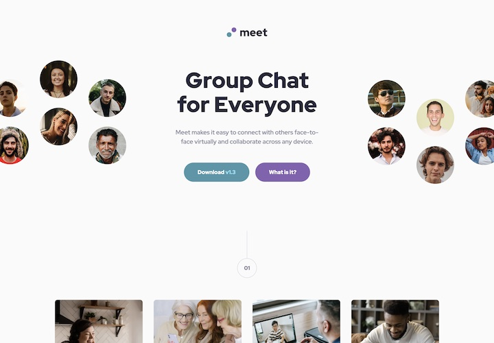

# Frontend Mentor - Meet landing page solution

This is a solution to the [Meet landing page challenge on Frontend Mentor](https://www.frontendmentor.io/challenges/meet-landing-page-rbTDS6OUR). Frontend Mentor challenges help you improve your coding skills by building realistic projects. 

## Table of contents

- [Overview](#overview)
  - [The challenge](#the-challenge)
  - [Screenshot](#screenshot)
  - [Links](#links)
- [My process](#my-process)
  - [Built with](#built-with)
  - [What I learned](#what-i-learned)
  - [Useful resources](#useful-resources)
- [Author](#author)

## Overview

### The challenge

Users should be able to:

- View the optimal layout depending on their device's screen size
- See hover states for interactive elements

### Screenshot



### Links

- Solution URL: [https://github.com/webdevbynight/meet-landing-page](https://github.com/webdevbynight/meet-landing-page)
- Live Site URL: [https://webdevbynight.github.io/meet-landing-page/](https://webdevbynight.github.io/meet-landing-page/)

## My process

### Built with

- Semantic HTML5 markup
- CSS (via SCSS)
  - custom properties
  - logical properties
  - flexbox
  - grid
- Mobile-first workflow

### What I learned

I learnt the `image-set()` CSS function to serve multiple resolutions of the same background image.

```css
.element {
  background-image: image-set(
    "images/my-image.webp" 1x,
    "images/my-image@2x.webp" 2x,
    "images/my-image@3x.webp" 3x,
    "images/my-image@4x.webp" 4x
  );
}
```

### Useful resources

- [Using Performant Next-Gen Images in CSS with image-set](https://css-tricks.com/using-performant-next-gen-images-in-css-with-image-set/) - This article explains how to serve multiple background images for various resolutions or MIME types with `image-set()`.
- [Can I use… CSS image-set](https://caniuse.com/css-image-set) - This helped me about browsers compatibility concerning `image-set()`.

## Author

- Website - [Victor Brito](https://victor-brito.dev)
- Frontend Mentor - [@webdevbynight](https://www.frontendmentor.io/profile/webdevbynight)
- Mastodon - [@webdevbynight](https://mastodon.social/webdevbynight)
